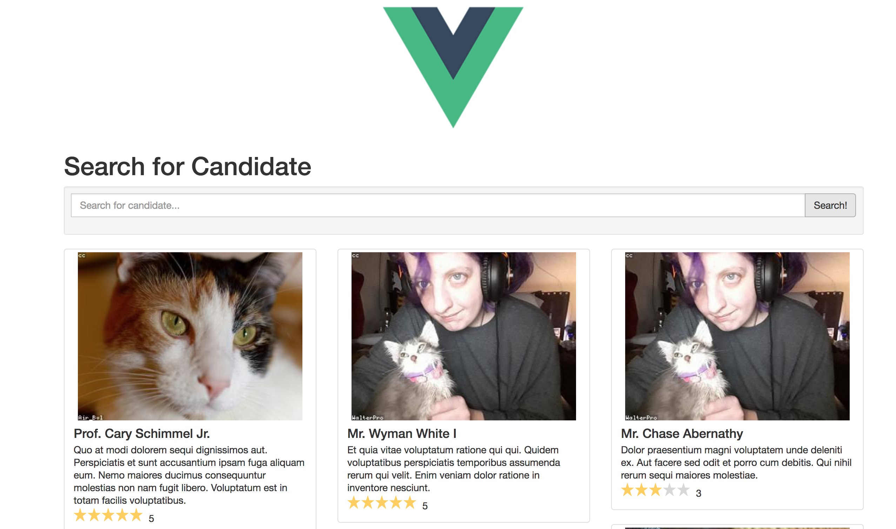

#Search-app

This project is the backend for another Vue JS project to search for candidates

## Running this app on local

1. Download repository ``$ git clone git@github.com:gitzblitz/search-app.git``

2. Change to directory ```$ cd search-app```

3. Set up your **.env** file with environment variables for database, Laravel Scout and Algolia API keys (https://www.algolia.com)

4. Run ```$ composer install```

5. Run the server ```$ php -S localhost:8000 -t public``` 
 
6. Run the migrations ```$ php artisan migrate```

7. Run the database seeder ```$ php artisan migrate --seed```



